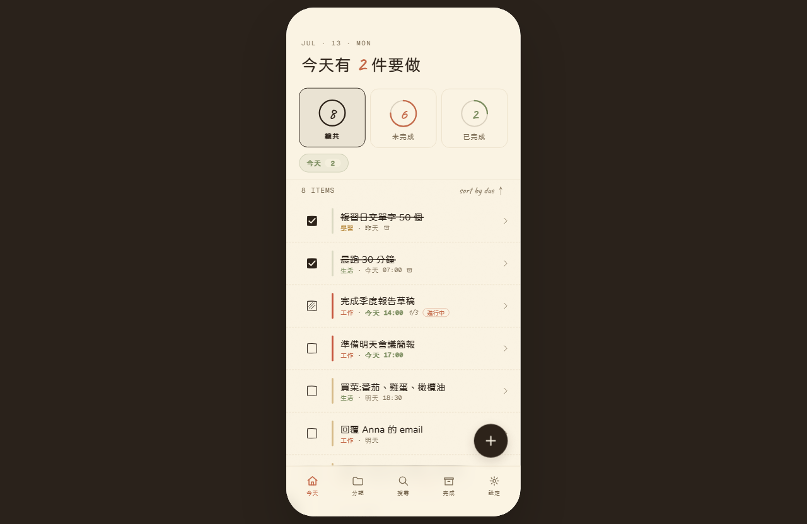
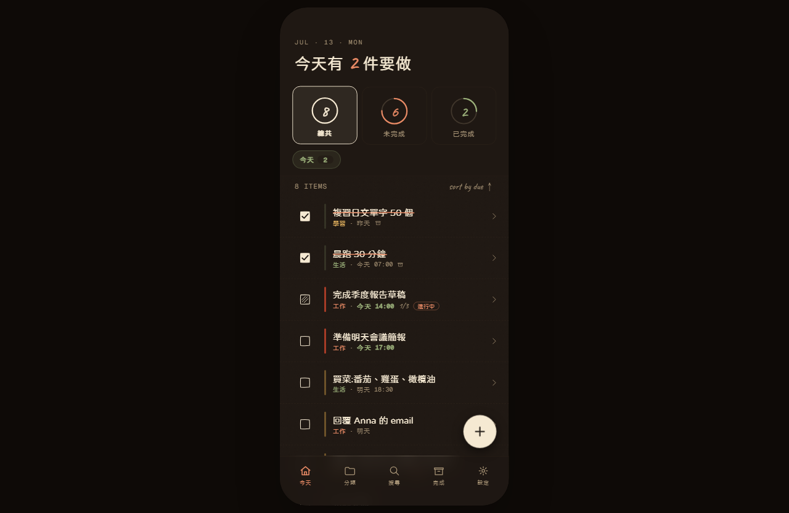

# 待辦事項 — Minimal Warm

**Live Demo：<https://todo-app-woad-zeta-20.vercel.app>**

暖極簡風格的繁體中文待辦事項 PWA —— 手繪感 UI、深色模式、離線可用，定位為 iPhone 主畫面安裝的個人 app。無後端，資料全存在裝置的 `localStorage`。

| 亮色模式 | 深色模式 |
| --- | --- |
|  |  |

> 寬螢幕以模擬 iPhone 外框展示；窄螢幕（≤500px）自動切換為全螢幕模式。首次開啟會載入以「今天」為基準的示範任務，可隨時在「設定 → 資料」重設或清空。

## 開發

```bash
npm install
npm run dev       # http://localhost:5173
npm run build     # 打包到 dist/
npm run preview   # 預覽打包結果
npm run test:e2e  # Playwright E2E（首次先跑 npx playwright install chromium）
```

## 畫面

1. **今天 Home** — 動態問候（依逾期 / 今天 / 一般狀態切換句型）+ 三環統計 + 焦點 chip（逾期 / 今天，有數字時自動出現）+ 任務清單依截止排序
2. **任務詳情 Detail** — 子任務、進度、提醒、備註
3. **新增 / 編輯 Edit** — 全屏表單，送出按鈕固定在右上常駐
4. **分類 Categories** — 工作 / 生活 / 學習
5. **搜尋 Search** — 快速篩選 + 最近搜尋
6. **完成 Archive** — 累積數 + 14 天打卡長條圖
7. **設定 Settings** — 個人卡片、深色模式開關、主題色、示範資料重設 / 清空（皆有二次確認）

## 互動

- 今天 / 分類 兩個 tab 的上方區塊（問候 + 統計 + 焦點 chip / 分類卡）會釘住，只有底下的任務列會捲動
- Home 頂部「逾期 N · 今天 M」chip 點下去自動切過濾 + 依截止時間排序，再點一次回全部
- 點清單任一項 → 詳情頁（水平滑動 ≥8px 視為手勢，不會誤觸進詳情；列表也支援鍵盤 Enter/Space 開啟）
- 詳情頁 ✎ → 編輯頁；編輯頁刪除任務會直接退回兩層，不會卡在「找不到任務」
- Home / 分類頁右下 + → 新增表單；儲存後回到原本所在的 tab（不會被丟回 home）
- 編輯有改動但按 X 離開會彈確認對話框；刪除任務會二次確認
- 底部 5 個分頁可互跳，切換或進詳情後再回來，捲動位置會還原
- 點 checkbox 切換 未開始 → 進行中 → 已完成
- 列表 row 顯示相對時間（今天 / 明天 / X 天內 / N/M），逾期 / 今天會用顏色與粗體強調
- Push（進詳情 / 編輯）與 Pop（返回）動畫方向不同，跨頁有方向感

## 截止日期 / 提醒 / 重複任務

- Edit 頁面用 HTML5 date / time picker 直接設定截止日（系統原生輸入）
- 提醒：關閉 / 準時 / 30 分前 / 1 小時前 / 1 天前 五段選項
- 重複：一次 / 每日 / 每週 / 每月；標記完成時自動 spawn 下一輪
- 通知層：[src/hooks/useReminders.js](src/hooks/useReminders.js) 每分鐘輪詢一次，截止前在前景觸發 `Notification`；> 24 小時過期的提醒會直接跳過避免騷擾
- 通知開關在「設定 → 通知 → 提醒通知」，第一次開啟會彈出系統權限對話框
- iPhone 上需以「加入主畫面」standalone 模式才能用 Web Notification（iOS 16.4+）

## 技術

- Vite 5 + React 18（單頁、無路由庫，自製 nav stack）
- 字型：Huninn（繁中手寫，自行託管子集化 woff2）、Noto Sans TC、Caveat、Geist Mono
- 響應式：寬螢幕顯示模擬的 iPhone 外框，窄螢幕（≤500px）切換為全螢幕模式

### 字型優化

- Huninn 原本從 CDN 載入完整 TTF（約 4.5MB）；現改為以 `pyftsubset` 子集化到「ASCII + Big5 常用字 + 全形標點 + 專案內出現過的字元」的 woff2（約 1.1MB），放在 [public/fonts/](public/fonts/) 自行託管，並加 `<link rel="preload">` 與 `font-display: swap`
- 罕見字（子集之外）會 fallback 到 Noto Sans TC / 系統字型

## 資料層

- 自製 `useStore`，資料寫入 `localStorage`（key: `mw_todos`）
- Schema v2：payload 包成 `{ version, todos }`，未來改欄位可安全 migrate；v1 的 bare array (`mw_todos_v1`) 會自動讀取一次
- 首次開啟（storage 為空）注入以當天日期為基準的示範任務，保證不會一開場就滿版逾期
- 寫入 debounce 400ms，避免連續勾選 / 編輯時頻繁 stringify
- 監聽 `storage` event：多分頁 / PWA 多視窗自動同步
- `beforeunload` / `pagehide` flush 未寫入的 pending 變更

## 測試 / CI

- E2E：[tests/e2e/](tests/e2e/)（Playwright + Chromium），涵蓋新增任務、完成任務、重複任務 spawn、v1→v2 storage migration、示範資料重設 / 清空
- CI：[.github/workflows/ci.yml](.github/workflows/ci.yml) — push / PR 觸發，Node 22，`npm ci → build → E2E`

## PWA / Service Worker

- 透過 [vite-plugin-pwa](https://vite-pwa-org.netlify.app/) 產生 Workbox SW（`registerType: 'autoUpdate'`）
- 預快取所有 `js / css / html / svg / png / woff2` build 產物（含自託管 Huninn 字型），離線可開
- runtime cache: Google Fonts 採 `CacheFirst`，1 年 TTL
- manifest 由 plugin 注入，含 maskable icon、`viewport-fit=cover`、`apple-mobile-web-app-status-bar-style: black-translucent`
- 加入 iPhone 主畫面後以 standalone 模式運行，safe-area 自動讓位給動態島與 Home Indicator

## Design system

- [src/designSystem/tokens.js](src/designSystem/tokens.js)：spacing / radius / shadow / typography / motion 集中管理
- [src/utils/categoryColor.js](src/utils/categoryColor.js)：`getCategoryColor()` 與 `STATE_LABEL`，取代原本散落 5 處的三元式
- 動效：tab 切換用 `mwIn` 細微淡入；push（Detail / Edit）用 `mwPush` 配 iOS spring 曲線；checkbox 完成有 `mwCheckPop` 彈跳
- 對比度：muted 文字色已調暗至 WCAG AA 4.5:1 標準

## 行動 / 無障礙

- 觸控目標：navbar icon、tab bar 按鈕、checkbox 皆 ≥ 44×44pt
- VoiceOver：checkbox 有 `aria-pressed` 與含任務標題的 `aria-label`
- 尊重 `prefers-reduced-motion`（暈眩敏感者進場動畫會被縮短至接近瞬間）
- 列表底部 padding 自動清出 tab bar + FAB 高度，最後一筆不會被遮
- 設定頁的破壞性動作（清空資料）用顏色 + 文字雙重警示，鍵盤可操作、焦點可見

## 來源與授權

- 從 Claude Design 設計稿實作，後續為個人迭代維護
- [MIT License](LICENSE) © 2026 maplestartend
